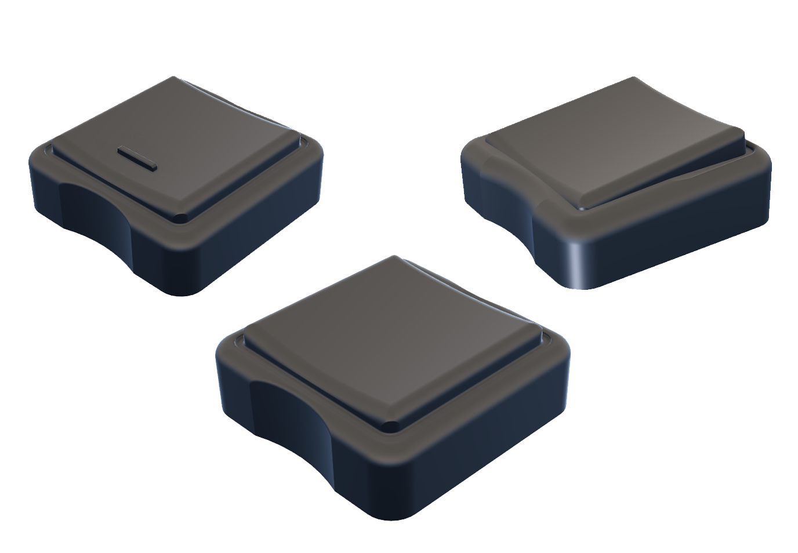
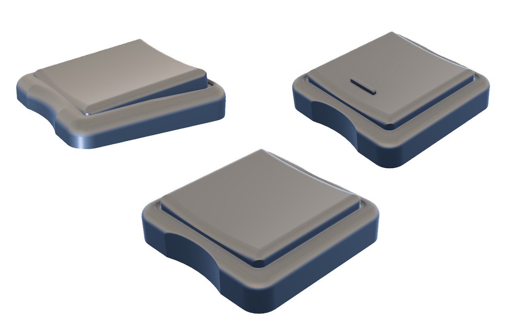
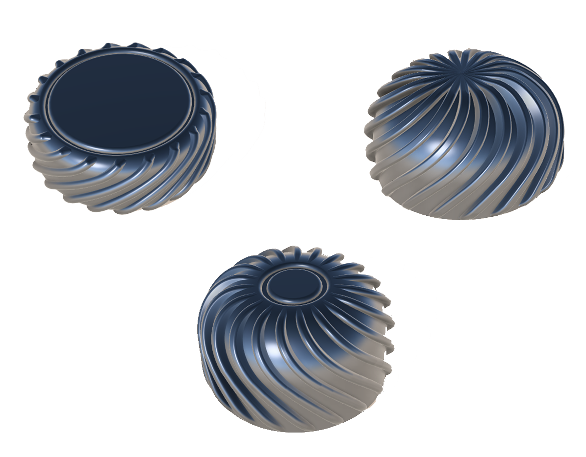

# Welcome to the 3D Printable Section  

## Keycaps  

[1. Cherry MX](/keycaps/mx/) - Keycaps that I would consider low profile for Cherry MX style switches  
	
  
   
[2. Low Profile](/keycaps/lp/) - Very thin keycaps made to fit Kailh Choc V2 switches  
	
  
   

## Knobs  

  
   

[1. EC-11](/knobs/EC11/) - Twirly knobs for EC-11 encoders (6mm diameter hole)  
	
[2. EC-12](/knobs/EC12/) - Twirly knobs for EC-12 encoders  

## Drift Keyboard V3  

[1. Battery Pack](/v3/battery-pack/) - The battery pack expansion parts  
	
[2. MCU Cover](/v3/mcu/) - Microcontroller covers for extra protection  
	
[3. Outer Frame](/v3/outer-frame/) - Outer parts usually referred to as outer acrylic frame  
	
[4. Plates](/v3/plates/) - Plates for Drift V2 and V3 (Bambu Labs A1 Mini support in .3mf file)  