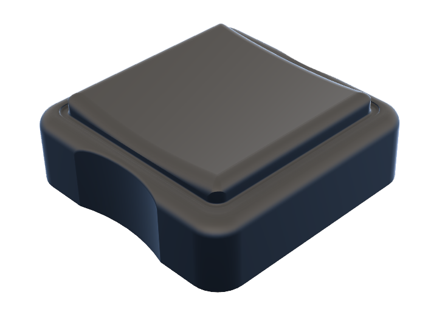
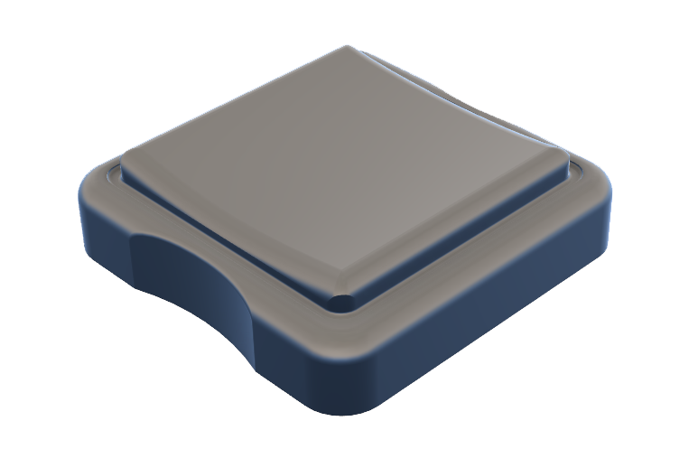

# Keycaps  

1. [Cherry MX Compatible](https://github.com/Timception/3d-printables/tree/main/keycaps/mx) - Keycaps that I would consider low profile for Cherry MX style switches  
	
  
   
  
2. [Low Profile](https://github.com/Timception/3d-printables/tree/main/keycaps/lp)- Very thin keycaps made to fit Kailh Choc V2 switches  
	
  
   

> [!NOTE]  
> These keycaps have been designed to be printed with a Fused Deposition Modeling (FDM) Printer  
>  
> The stems are slightly thinned so that they can fit switches easily.  
>  
>  