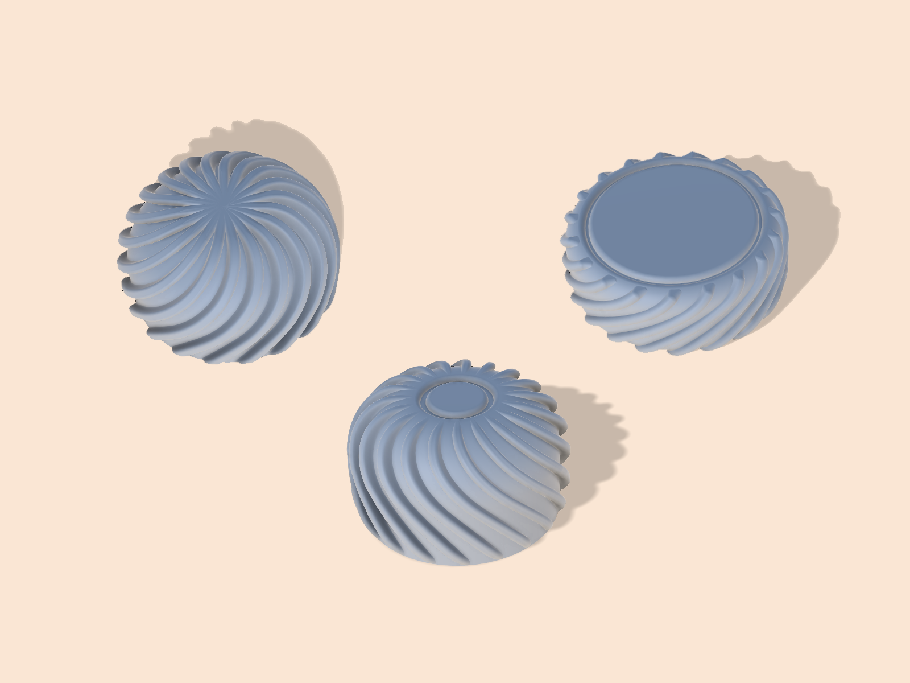
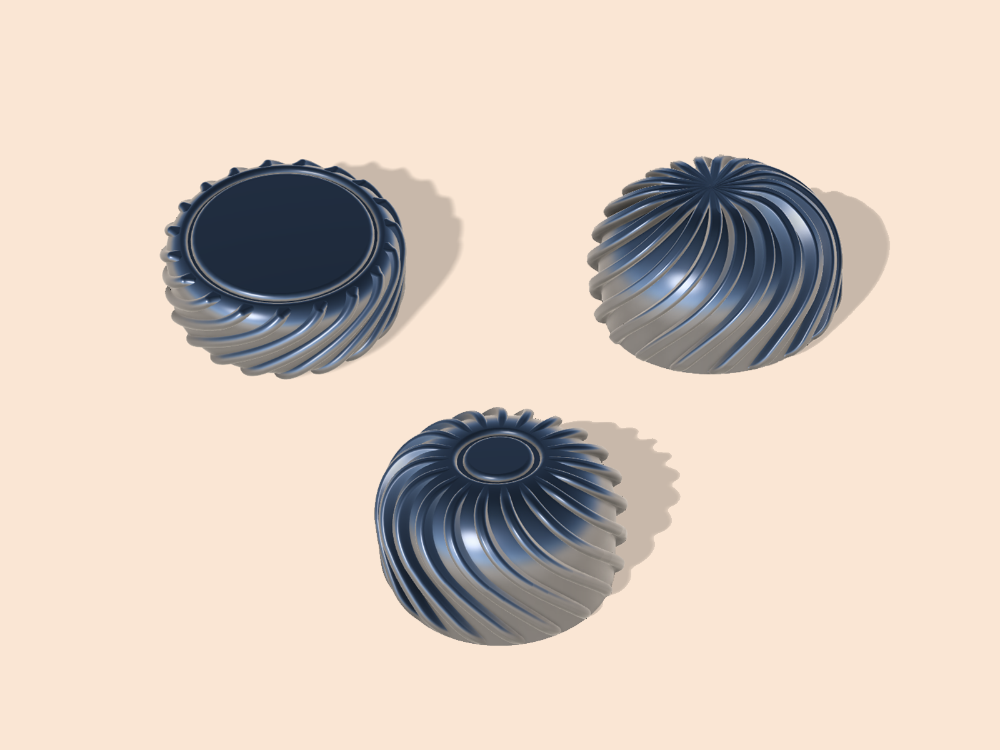

# Encoder Knobs  

1. [EC-11](/knobs/EC11/) - Twirly knobs for EC-11 encoders  
(6mm diameter hole, not for D-Shaft type)  
	
  
   

2. [EC-12](/knobs/EC12/) - Twirly knobs for EC-12 encoders  

  
   

> [!NOTE]  
> These knobs have been designed to be printed with a Fused Deposition Modeling (FDM) Printer  
>  
> PLA seemed to work fine  
>  
> 